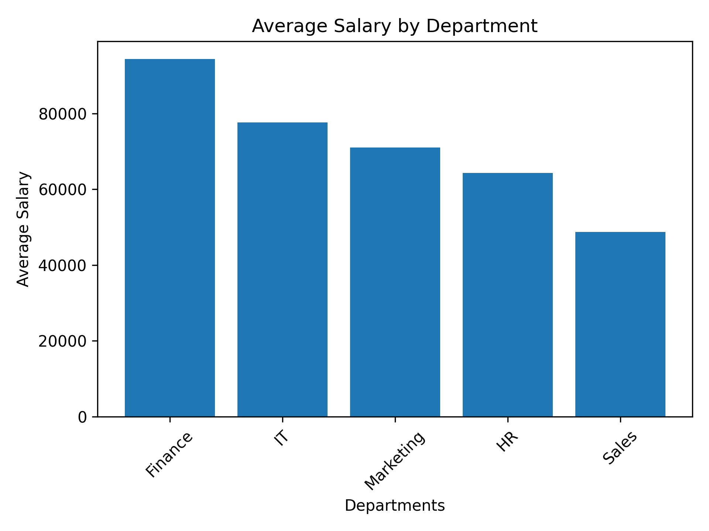
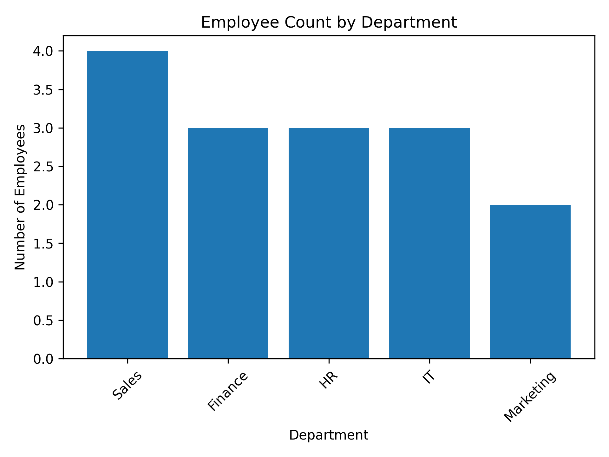
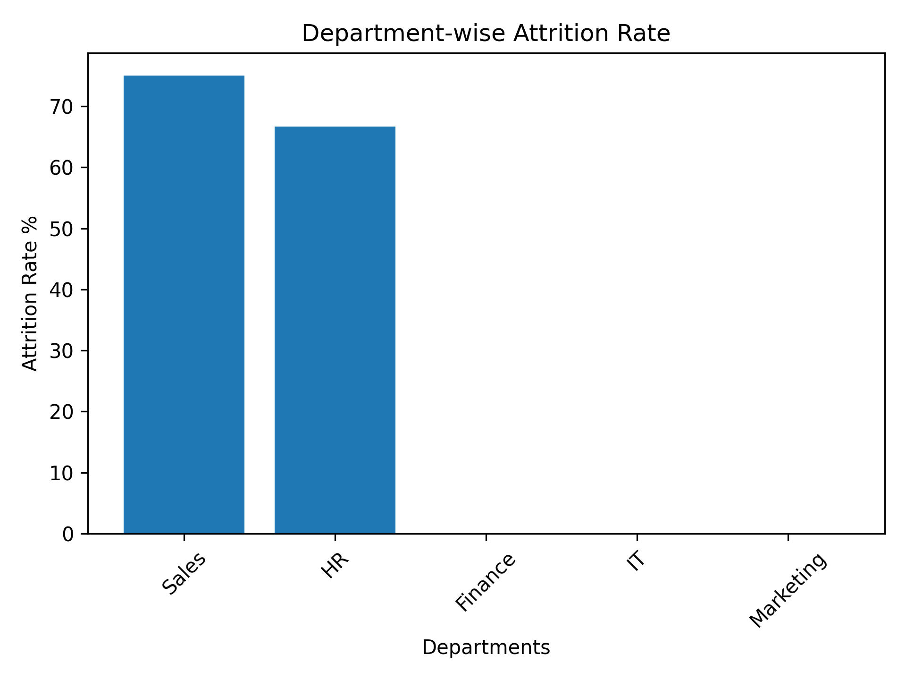
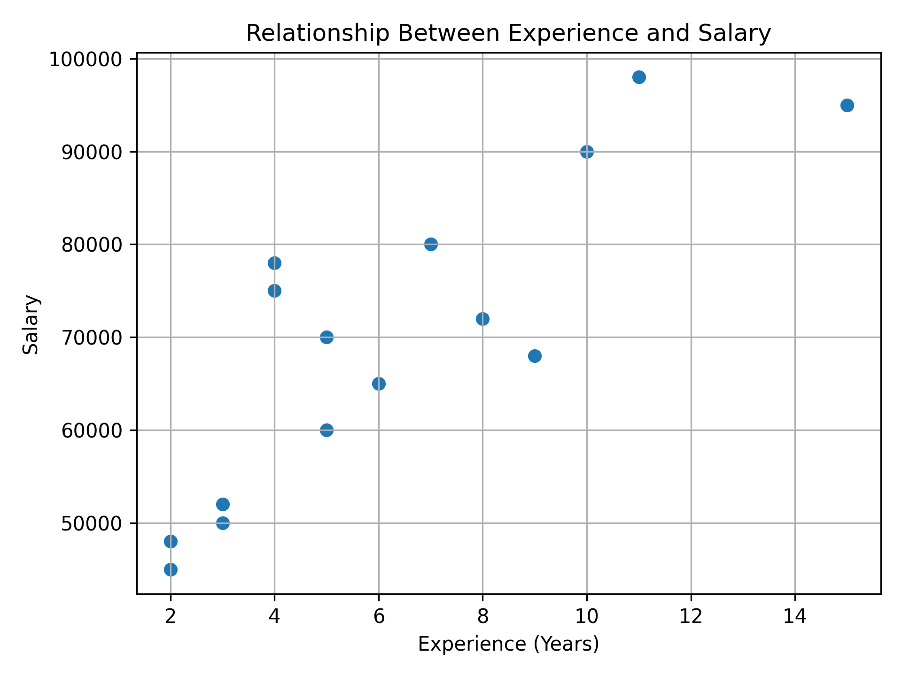
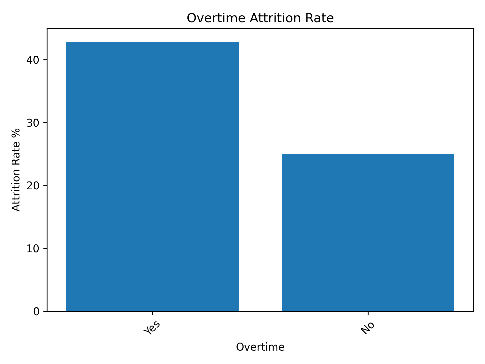
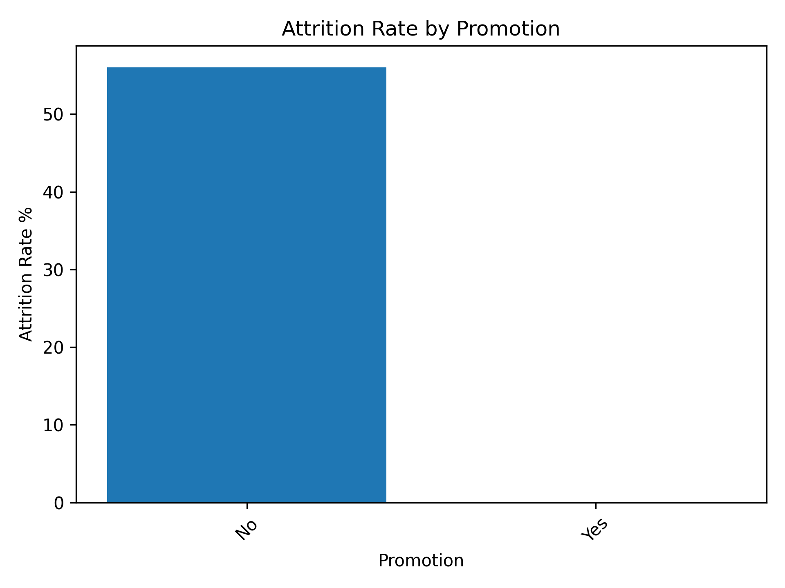
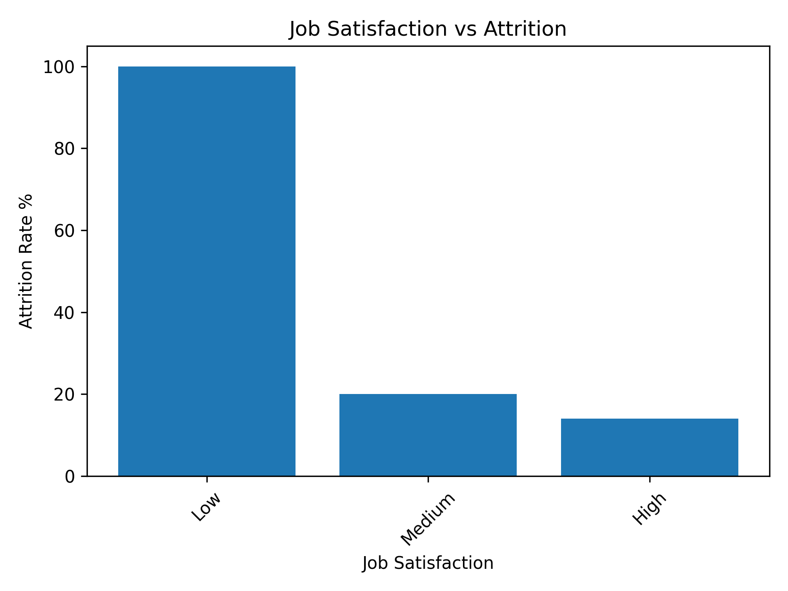

# HR Analytics Project using Python

## Project Overview

This project analyzes HR employee data using Python to identify workforce trends, employee attrition, salary distribution, job satisfaction, overtime impact, promotions, and other key HR metrics. The project demonstrates the complete data analytics workflow, including data cleaning, exploratory data analysis (EDA), visualization, and business recommendations.

## Business Problem

Employee attrition is a major challenge for organizations because it increases recruitment costs, reduces productivity, and affects business continuity.

The objective of this project is to analyze employee data to identify factors influencing attrition and provide data-driven recommendations to improve employee retention.

## Technologies Used

- Python
- Pandas
- NumPy
- Matplotlib
- Google Colab

## Dataset

The dataset contains employee information including:

- Employee ID
- Department
- Age
- Gender
- Experience
- Salary
- Performance Rating
- Job Satisfaction
- Overtime
- Promotion
- Attrition

## Project Workflow

1. Data Loading
2. Data Inspection
3. Data Cleaning
4. Exploratory Data Analysis
5. Data Visualization
6. Business Insights
7. Business Recommendations

## Key Findings

- Finance department has the highest average salary.
- Sales department has the highest employee attrition.
- Employees working overtime have a higher attrition rate.
- Low job satisfaction is associated with higher employee attrition.
- Promotions appear to improve employee retention.
- Employee experience has a strong positive relationship with salary.

## Business Recommendations

- Review employee retention strategies in the Sales department.
- Improve work-life balance by monitoring overtime.
- Increase employee engagement to improve job satisfaction.
- Continue providing career growth opportunities through promotions.
- Periodically review salary structures to ensure competitive compensation.

## Skills Demonstrated

- Data Cleaning
- Data Transformation
- Exploratory Data Analysis (EDA)
- Data Visualization
- Business Analysis
- Statistical Analysis
- Business Reporting
- Python Programming
- Pandas
- NumPy
- Matplotlib

## Screenshots

### Average Salary by Department

### Number of Employees per Department

### Department-wise Attrition

### Experience vs Salary

### Overtime vs Attrition

### Promotion vs Attrition

### Job Satisfaction vs Attrition

